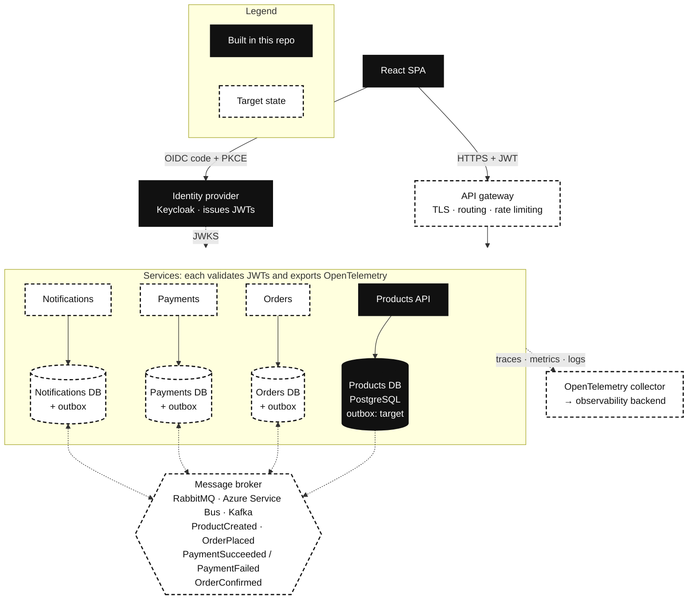
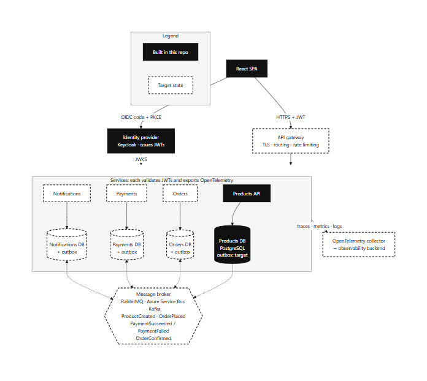

# Architecture

How the Products service fits into an event-driven microservices system. Solid black boxes are built in this repository; dashed boxes are the target state.

- **Database per service.** Each service owns its schema; no service reads another service's tables.
- **Transactional outbox and idempotent consumers.** A service commits its state change and the outgoing event in one transaction, a relay publishes the outbox, and consumers record processed message ids so at-least-once delivery is safe.
- **Choreographed order → payment saga.** Orders publishes OrderPlaced; Payments charges and publishes PaymentSucceeded or PaymentFailed; Orders confirms or cancels and publishes OrderConfirmed; Notifications emails the customer.
- **Local read models instead of synchronous calls.** Orders keeps the product name and price it needs from ProductCreated, so it never calls Products at request time and an outage cannot cascade.
- **Stateless horizontal scaling.** Services validate JWTs locally against the identity provider's JWKS and hold no session state, so replicas can be added freely; EF Core's migration lock keeps simultaneous startups safe.
- **Cross-cutting concerns at the gateway.** TLS termination, routing and rate limiting live in the gateway; nginx stands in for it locally.
- **Observability.** Every service exports traces, metrics and logs through OpenTelemetry to one backend.
